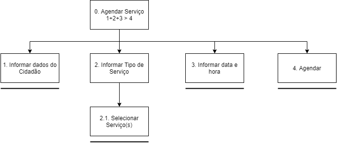

# Análise Hierarquica de Tarefas

## 1. Introdução

 
Uma análise de tarefas é utilizada para se ter um entendimento sobre qual é o trabalho dos usuários, como eles o realizam e por quê. Nesse tipo de análise, o trabalho é definido em termos dos objetivos que os usuários querem ou precisam atingir (Barbosa S.; Silva, B. 2021).

## 2. O Método

 
A Análise Hierárquica de Tarefas (HTA – Hierarchical Task Analysis) foi criada para entender habilidades e competências exibidas em tarefas não repetitivas e complexas, e ajudar na identificação de problemas de desempenho. Relaciona o motivo, como e consequências das ações dos usuários. Baseada na psicologia funcional. A HTA examina os objetivos de alto nível decompondo-os em subobjetivos, com a intenção de encontrar subobjetivos que limitem o alcance de objetivos maiores. 

 
Elementos de um diagrama HTA:

- Objetivo;
- Operação;
- Relações;
- Plano.

## 3. Resultados

### HTA01: Agendar Serviço

#### Diagrama HTA

<figcaption style="text-align: center">Figura 1: Diagrama referente a tarefa de agendar um serviço no Detran-DF</figcaption>

<a href="https://github.com/Interacao-Humano-Computador/2021.1-Detran-DF/blob/9bbc647fd93dca8c7485d79b87f9591afaacea3b/docs/assets/analiseRequisitos/HTA/HTA-AgendarServico.png"> Link da imagem </a>

#### Tabela HTA
| Objetivo/Operações | Problemas e Recomendações |
| -- | -- |
| 0. Agendar Serviço   
1+2+3>4
 | input: formulário com dados do cidadão, dados do agendamento e data e hora.  plano: informar os dados e agendar serviço.|
| 1. Informar dados do Cidadão | ação: informar CPF, E-mail, Nome e Telefone.|
| 2. Informar Tipo de Serviço | ação: selecionar Tipo de Serviço   problema: serviços indisponíveis|
| 2.1 Selecionar Serviço(s)| ação: selecionar os serviços desejados|
| 3. Informar data e hora | ação: informar dia do atendimento e horário do atendimento.   problema: somente alguns dias e horários disponíveis.|
| 4. Agendar | ação: apertar botão de agendar.|

### HTA02: Consultar Débitos Veículo

#### Diagrama HTA

<figcaption style="text-align: center">Figura 1: Diagrama referente a tarefa de consultar os possíveis débitos de um veículo</figcaption>

<a href="https://github.com/Interacao-Humano-Computador/2021.1-Detran-DF/blob/9bbc647fd93dca8c7485d79b87f9591afaacea3b/docs/assets/analiseRequisitos/HTA/HTA-Consultar%20D%C3%A9bitos%20de%20Veiculo.png"> Link da imagem </a>

#### Tabela HTA
| Objetivo/Operações | Problemas e Recomendações |
| -- | -- |
| 0. Consultar Débitos Veículo   
1+2>3
 | input: formulário com placa e renavam do veículo.   plano: Consultar todos os débitos do veículo. |
| 1. Informar placa e renavam | ação: Informar placa e renavam. |
| 2. reCAPTCHA | ação: clicar em "Não sou um robô" |
| 3. Consultar| ação: clicar em Consultar |
| 3.1 Emitir boleto de débito | ação: clicar no botão Emitir do débito correspondente|

### HTA03: Solicitar CHN Definitiva

#### Diagrama HTA

<figcaption style="text-align: center">Figura 1: Diagrama referente a tarefa de solicitar a emissão da CNH definitiva</figcaption>

<a href="https://github.com/Interacao-Humano-Computador/2021.1-Detran-DF/blob/9bbc647fd93dca8c7485d79b87f9591afaacea3b/docs/assets/analiseRequisitos/HTA/HTA-Solicitar%20CNH%20definitiva.png"> Link da imagem </a>

#### Tabela HTA
| Objetivo/Operações | Problemas e Recomendações |
| -- | -- |
| 0. Solicitar CNH Definitiva   
1>2
 | input: formulário com código, registro, nome e data de nascimento.   plano: obter borderô de taxa de troca de habilitação. |
| 1. Preencher formulário | ação: informar código da imagem, número de registro, nome e data de nascimento.   problema: é preciso recarregar a página para o formulário ficar visível.   recomendação1: incorporar formulário ao HTML da página.   recomendação2: seguir guia de estilo do site/sistema.|
| 2. Enviar | ação: clicar no botão enviar |
| 2.1 Baixar borderô | ação: baixar borderô |

### HTA04: Transferir propriedade de um veículo

#### Diagrama HTA

<figcaption style="text-align: center">Figura 1: Diagrama referente a tarefa de realizar a transferência de propriedade de um veículo</figcaption>

<a href="https://github.com/Interacao-Humano-Computador/2021.1-Detran-DF/blob/9bbc647fd93dca8c7485d79b87f9591afaacea3b/docs/assets/analiseRequisitos/HTA/HTA-Transferir%20a%20propriedade%20de%20um%20ve%C3%ADculo.png"> Link da imagem </a>

#### Tabela HTA
| Objetivo/Operações | Problemas e Recomendações |
| -- | -- |
| 0. Tranferir a propriedade de um veículo  
 1/2>3>4 
 | input: formulário com placa, renavam e captcha.   plano: realizar vistoria para transferir a propriedade do veículo.   problema: site usado para realizar a ação é um diferente do Detran-DF e seu portal, adicionando assim mais um site ao caminho |
| 1. Agendar Vistoria do Veículo | ação: entrar na área de agendamento de serviços e agendar a vistoria.   problema: é preciso voltar ao portal para assim selecionar a opção de realizar vistoria.   recomendação1: colocar um link que redirecionará o usuário para a área de agendamento de serviços. |
| 1.1 Realizar Vistoria | ação: Realizar Vistoria presencialmente em uma unidade do Detran-DF|
| 2. Informar dados do Veiculo | ação: preencher formulário com dados do veículo |
| 2.1 Informar placa, renavam e responder o Captcha | ação: informar a placa e renavam do veículo e responder o Captcha |
| 3. Pagar Dívidas Ativas do Veículo   
1/2
 | ação: Verificar se há dividas referentes ao veículo, se sim, efetuar o pagamento |
| 3.1 Emitir boleto de pagamento | ação: emitir boleto para o pagamento da dívida e realiza-lo |
| 3.2 Acessar site da receita Federal caso a dívida seja o IPVA | ação: Acessar o site da Receita Federal para obter o boleto de pagamento do IPVA |
| 4 Agendamento da transferência da propriedade do veículo | ação: Realizar o agendamento/informativo da transferência de propriedade do veículo |
| 4.1 Confirmação do agendamento | ação: confirmar e realizar a transferência do veículo |

### HTA05: Agendamento de Biometria

#### Diagrama HTA

<figcaption style="text-align: center">Figura 1: Diagrama referente a tarefa de realizar o agendamento do cadastro de biometria</figcaption>

<a href="https://github.com/Interacao-Humano-Computador/2021.1-Detran-DF/blob/9bbc647fd93dca8c7485d79b87f9591afaacea3b/docs/assets/analiseRequisitos/HTA/HTA-Agendamento%20de%20Biometria.png"> Link da imagem </a>

#### Tabela HTA
| Objetivo/Operações | Problemas e Recomendações |
| -- | -- |
| 0. Agendamento de Biometria   
1>2>3
 | input: CPF, nome, senha, local de agendamento, data do agendamento e horario do agendamento   plano: Agendar o cadastro de Biometria em um posto de atendimento do Detran-DF   problema: O site utilizado para o agendamento da biometria é outro além dos já citados, com cadastro próprio. |
| 1. Entrar ou cadastrar-se   
1/2
 | ação: Acessar o site de realização do agendamento de biometria   problema: cadastro próprio do site.   recomendação: Usar o cadastro do portal de serviços do Detran-DF |
| 1.1 Inserir CPF e senha para entrar | ação: inserir CPF e Senha para login no site |
| 1.2 Se cadastrar | ação: realizar cadastro no site para efetuar o agendamento. |
| 2. Clicar em novo agendamento | ação: clicar em novo agendamento para segui para página desejada. |
| 2.1 Inserir dados para o agendamento | ação: escolher o posto de atendimento, a data de agendamento e o horário de agendamento |
| 3. Clicar em cadastrar | ação: clicar em "cadastrar" para finalizar o agendamento. |

### HTA06: Acessar informações

#### Diagrama HTA

<figcaption style="text-align: center">Figura 1: Diagrama referente a tarefa de acessar informações diversas</figcaption>

<a href="https://github.com/Interacao-Humano-Computador/2021.1-Detran-DF/blob/9bbc647fd93dca8c7485d79b87f9591afaacea3b/docs/assets/analiseRequisitos/HTA/HTA-Acessar%20informa%C3%A7%C3%B5es.png"> Link da imagem </a>

#### Tabela HTA
| Objetivo/Operações | Problemas e Recomendações |
| -- | -- |
| 0. Acessar Informações   
1/2/3
 | input: palavra-chave para pesquisa.   plano: obter as informações desejadas no site do Detran-DF. |
| 1. Escolher categoria pela barra superior | ação: Escolher categoria desejada pela barra de superior de seleção. |
| 1.1 Escolher a página de informação dentro da categoria | ação: escolher informação dentro das categorias mostradas após escolha na barra superior   problema: Muitas escolhas.   recomendação: Deixar a escolha de temas e categorias mais intuitivas e auxiliar o usuário nessa escolha. |
| 2. Escolher a informação rolando a página | ação: Escolher a informação desejada após rolar o site.   problema: Página muito poluída visualmente, ocasionando confusão ao usuário   recomendação: usar de um design mais minimalista para mostrar as informações de destaque |
| 3. Pesquisar a informação | ação: Pesquisar pela informação desejada usado a barra de pesquisa do site.   problema: Se a informação for uma funcionalidade do site e não uma noticia a pesquisa responde com informações erradas.   recomendação: incluir páginas referentes á funcionalidades ofertadas pelo sítio nos resultados de pesquisa. |

## Referências bibliográficas
> Barbosa, S. D. J.; Silva, B. S. da; Silveira, M. S.; Gasparini, I.; Darin, T.; Barbosa, G. D. J. (2021) Interação Humano-Computador e Experiência do usuário. Autopublicação.

## Versionamento
| Versão | Data | Modificação| Autor |
|--|--|--|--|
| 1.0 | 23/08/2021 | Criação do documento | Carlos e Matheus |
| 1.1 | 23/08/2021 | Adição dos resultados | Carlos e Matheus |
| 1.2 | 26/08/2021 | Correção de diagramas e adição de novos | Carlos e Matheus |