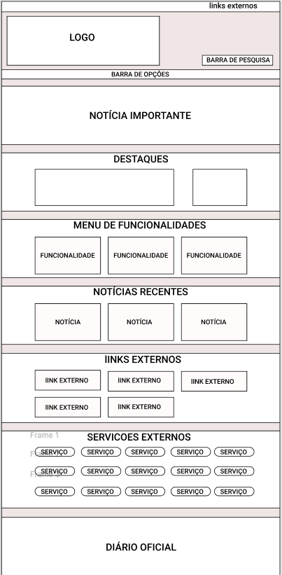
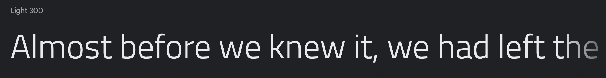
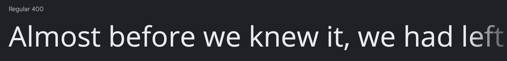
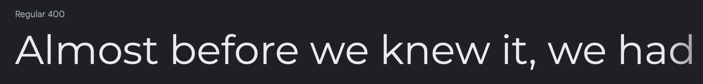
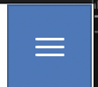
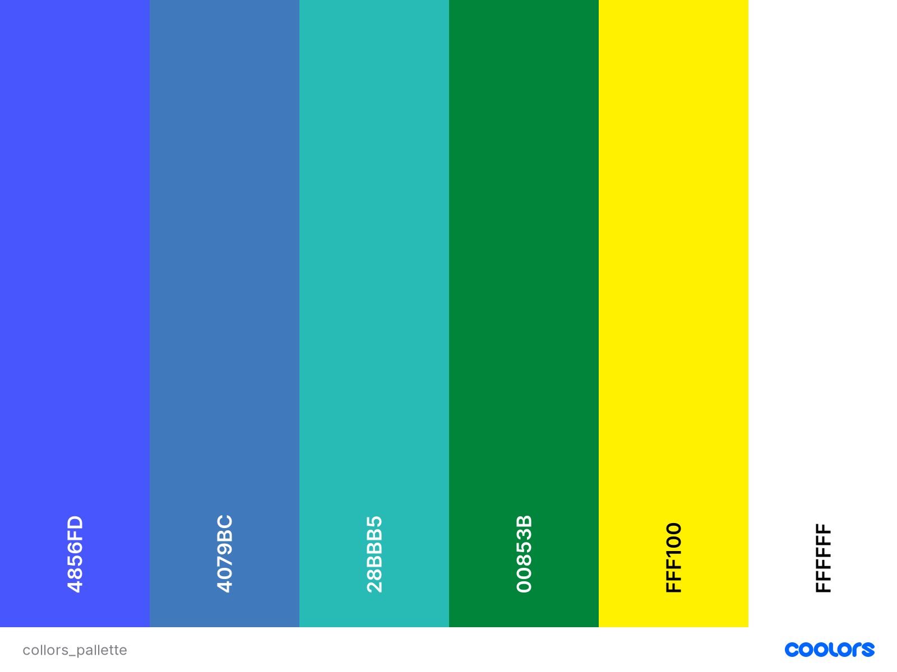
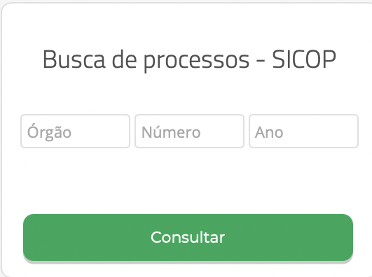
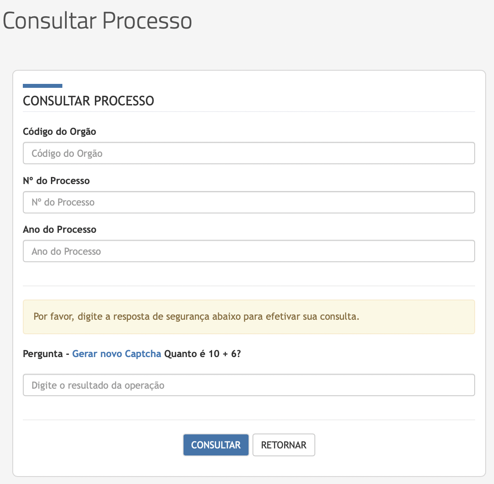
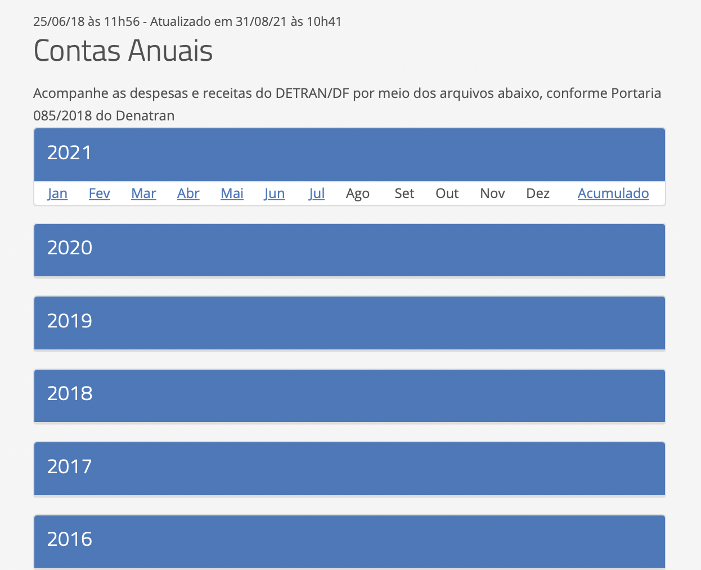

## 1. Introdução

## 1.1. Objetivo do guia de estilo

Trata-se de um registro das principais decisões de design tomadas, de forma que elas não se percam, isto é, sejam efetivamente incorporadas no produto final. O guia de estilo tem como objetivo se tornar um meio de comunicação entre os membros de design, assim como os desenvolvedores, para servir como base para tomadas de decisão e criação de padrões que podem ser reutilizados durante versoes futuras.

Um guia de estilo pode ser criado com diferentes escopos: plataforma, corporativo, familia de produtos e um produto específico (Mayhew, 1999).

## 1.2. Organização e conteúdo do guia de estilo

Para organização do guia de estilo, teremos como base o ciclo de vida de Mayhew, o que sugere que o guia de estilo seja refinado a cada ciclo.

## 1.3. Público-alvo do guia de estilo

    Nós, que desenvolveremos o protótipo e possíveis desenvolvedores que realizarão alterações no site.

## 1.4. Como utilizar o guia

O guia deve ser utilizado como base para modificação, atualização ou novas implementações do site, tendo em vista que o site escolhido ja foi desenvolvido.

## 1.5. Como manter o guia

Como já citado anteriomente, o ciclo de vida de Mayhew nós indica fazer modificações a cada ciclo do processo.

## 2. Resultado da análise

## 2.1. Descrição do ambiente de trabalho

O usuário, ao acessar o site, se depara com um baner com informações sobre funcionalidades do sistema. Em seguida, o site o mostra as informações em destaque, após isso é apresentado um menu com as principais funcionalidades do site. Em seguida são apresentados links externos, assim como seus serviços e funcionalidades. 

## 3. Elementos de interface

### 3.1 Disposição espacial e grid

O grid está disposto de forma que o usuário tem que descer muito a página para encontrar alguns elementos, isso se dá pelo excesso de elementos no layout. Algumas seções contem elementos correlacionados, que poderiam ser melhor alocados.

### 3.2 Janelas

O site possui inúmeras janelas. Janelas informativas sobre o Detran como: estrutura, postos de atendimento, base júridica, agenda do diretor, janelas de serviço, janelas sobre educação, janelas de transparência pública, estatísticas, portais de serviços e sala de imprensa.
 

### 3.3 Tipografia

As fontes utilizadas pelo site são: Montserrat, open sans e titillium Web.

### 3.4 Símbolos não tipográficos

O site utiliza minimamente de símbolos não tipográficos, nosso grupo encontrou apenas três deles.

 
    Esses símbolos representam a funcionalidade de busca, o menu do site e a funcionalidade de libras respectivamente. Todos os ícones são intuitivos, já que são utilizados como padrão em sites na atualidade, o símbolo de libras pode ser um menos intuitivo mas ao passar o mouse por cima, uma explicação aparece ao lado.

### 3.5 Cores

    Há pouca variação de cores, porém as tonalidades possuem uma grande diferença. As cores utilizadas foram:

### 3.2 Animações

    Algumas animações podem ser encontradas no site, assim como citado anteriomente, quando o mouse está sobre o ícone de libras uma caixa aparece para explicar sobre a funcionalidade. Alem desse animação, há algumas pequenas animações em botões e textos quando o mouse está sobre eles. 

## 4. Elementos de interação

### 4.1. Estilos de interação

    O site utiliza de menus, para navegação entre janelas, alem de linguagem natural que indica onde estão as funcionalidades e sobre suas utilizações. O site tambem se utiliza de hyperlinks para direcionar o usuário as funcionalidades que estão em links externos.

### 4.2. Seleção de um estilo

    Menu de navegação e a utilização de hyperlinks são predominantes no site. Tornando o fluxo de utilização de uma funcionalidade em: 

1. Procurar a funcionalidade desejada no menu de navegação;
2. Entrar na janela relacionada;
3. Clicar no hyperlink;
4. Ser redirecionado para a funcionalidade desejada.

### 4.3. Aceleradores

    Nosso grupo não encontrou aceleradores ou teclas de atalho no site.

## 5. Elementos de ação

### 5.1. Preenchimento de campos

    Para realizar uma consulta sobre algum processo, o usuário deve informar alguns dados do processo, se o usuário não informar todos os dados ou informá-los de forma incorreta, o sistema impossibilita a realização do mesmo. Como citado anteriormente no guia de estilo, o layout inicial possui inúmeros elementos o que causa o dificil acesso de alguns deles, um exemplo é a consulta de processo que existe em uma janela expecifica porém também faz parte do layout inicial. 

### 5.2. Seleção

    Ao procurar por contas anuais na janela de transparência pública, o usuário se depara com elementos de seleção de ano e mês para gerar o documento de contas.

### 5.4. Ativação

    A ativaçäo dos formulários de dá ao clicar no botão de enviar que é encontrado na parte inferior de todo formulário do site, já nos elementos de seleção, a ativação se da no momento de escolha do mês.

## 6. Vocabulários e padrões

### 6.1. Termologia

    Como citado anteriormente, o site possui não somente muitos links externos, como conteúdos externos. Devido a esse motivo, o vocabulário do site é vasto, assim como a termos nixados.

### 6.2. Tipos de tela

    As telas do site seguem um padrão, baseado em um menu lateral com tópicos e o contéudo da tela na direita. Algumas telas fogem desse padrão, como por exemplo a tela inicial mas não causa um desconforto ao usuário.  

### 6.3. Sequência de diálogos

    O sistema nos apresenta uma mensagem na parte superior do site quando realizamos algumas requisição, tanto quando a requisição é aceita quanto quando existe problemas com a mesma.

## Referências

1. Todas imagens utilizadas foram retiradas do site do Detran-DF
> Barbosa, S. D. J.; Silva, B. S. da; Silveira, M. S.; Gasparini, I.; Darin, T.; Barbosa, G. D. J. (2021) Interação Humano-Computador e Experiência do usuário. Autopublicação.
3. Diagramas apresentados foram criados

## Versionamento

| Versão | Data | Modificação| Autor |
|--|--|--|--|
| 1.0 | 03/09/2021 | Criação do documento |  Arthus e Marcos Felipe |