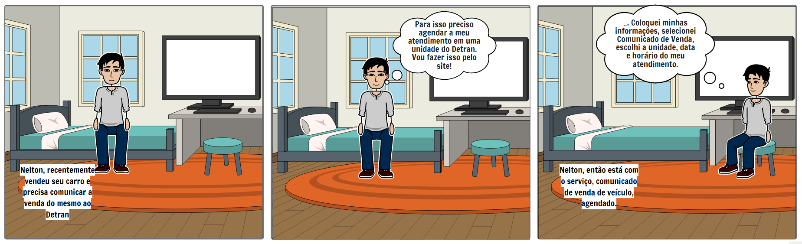
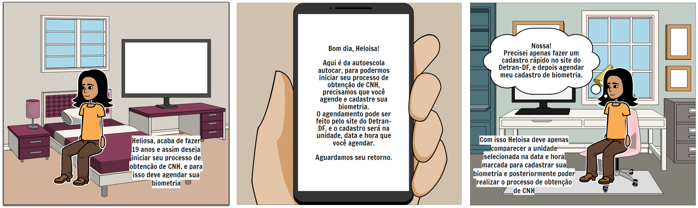

# Storyboards

## 1. Introdução

 
Storyboard é um protótipo de baixa fidelidade usado em conjunto geralmente com cenários. Ele deve ilustrar um objetivo através de desenhos que mostram o fluxo de execução de uma tarefa. 

 
Um storyboard deve ter:

- Pessoas envolvidas; 
- Ambiente; 
- Tarefa a ser feita; 
- Passos para realizar a tarefa; 
- O que motiva os usuários a usar o sistema.

## 2. Resultados

 
A seguir encontra-se storyboards desenvolvidos a partir da análise de tarefas.

### 2.1 Storyboard 1 - Agendar Serviço

#### Preparo

Pessoas envolvidas:

- Persona: Nelton Ribeiro Filho

Ambiente da história:

- Quarto de Nelton

Tarefa a ser abordada:

- Agendar serviço no portal Detran-DF

#### Sequência

Quais passos para a realização da tarefa:

- 1- Necessita comunicar ao Dentran-DF que vendeu seu carro
- 2- Acessar portal Detran-DF
- 3- Agendar Serviço

#### Satisfação

Motivação principal da pessoa que usa a aplicação:

- Agendar serviço online para informar que vendeu seu carro

Definição das realizações que a aplicação permite:

- Agendar Serviço

Definição das necessidades que a aplicação se propõe a sanar:

- Permitir o agendamento de serviços online

<figcaption style="text-align: center">Figura 1: Imagem referente ao storyboard 1 de agendar um serviço no Detran-DF</figcaption>
<figcaption style="text-align: center">Fonte: Autores</figcaption>

<figcaption style="text-align: center"><a href="https://github.com/Interacao-Humano-Computador/2021.1-Detran-DF/blob/b0f89850495e2961e0ca772880daa11c3ebc0213/docs/assets/DesignAvDe/nivel1/storyboards/storyboard1.png"> Link da imagem </a></figcaption>

### 2.2 Storyboard 2 - Agendar Biometria

#### Preparo

Pessoas envolvidas:

- Persona: Eloisa Feitosa

Ambiente da história:

- Quarto de Eloisa

Tarefa a ser abordada:

- Agendar Biometria no portal Detran-DF

#### Sequência

Quais passos para a realização da tarefa:

- 1- Autoescola informa que é necessário agendar biometria
- 2- Acessar portal Detran-DF
- 3- Agendar Biometria

#### Satisfação

Motivação principal da pessoa que usa a aplicação:

- Agendar biometria para registro de CNH

Definição das realizações que a aplicação permite:

- Agendar biometria

Definição das necessidades que a aplicação se propõe a sanar:

- Permitir o agendamento da biometria online

<figcaption style="text-align: center">Figura 2: Imagem referente ao storyboard 2 de agendar biometria no Detran-DF</figcaption>
<figcaption style="text-align: center">Fonte: Autores</figcaption>

<figcaption style="text-align: center"><a href="https://github.com/Interacao-Humano-Computador/2021.1-Detran-DF/blob/b0f89850495e2961e0ca772880daa11c3ebc0213/docs/assets/DesignAvDe/nivel1/storyboards/storyboard2.png"> Link da imagem </a></figcaption>

### 2.3 Storyboard 3 - Acessar Informação

#### Preparo

Pessoas envolvidas:

- Persona: José Fernandes

Ambiente da história:

- Casa de José

Tarefa a ser abordada:

- Acessar preço de serviço no portal Detran-DF

#### Sequência

Quais passos para a realização da tarefa:

- 1- Necessário acessar portal Detran-DF para saber preço de serviço
- 2- Acessar portal Detran-DF
- 3- Baixar arquivo com tabela de preços de serviços

#### Satisfação

Motivação principal da pessoa que usa a aplicação:

- Acessar informação sobre preço de serviços

Definição das realizações que a aplicação permite:

- Acesso a informações de preços de serviços

Definição das necessidades que a aplicação se propõe a sanar:

- Permitir o acesso a informações de preços de serviços

<figcaption style="text-align: center">Figura 3: Imagem referente ao storyboard 3 de consultar informação no Detran-DF</figcaption>
<figcaption style="text-align: center">Fonte: Autores</figcaption>

<figcaption style="text-align: center"><a href="https://github.com/Interacao-Humano-Computador/2021.1-Detran-DF/blob/b0f89850495e2961e0ca772880daa11c3ebc0213/docs/assets/DesignAvDe/nivel1/storyboards/storyboard3.png"> Link da imagem </a></figcaption>

### 2.4 Storyboard 4 - Solicitar CHN definitiva

#### Preparo

Pessoas envolvidas:

- Persona: João Paulo

Ambiente da história:

- Casa de João

Tarefa a ser abordada:

- Solicitar CHN definitiva

#### Sequência

Quais passos para a realização da tarefa:

- 1- CNH provisória de João venceu
- 2- João se questiona sobre dirigir com CHN vencida
- 3- João consulta portal Detran-DF para obter informações sobre como solicitar CNH definitiva
- 4- João acessa portal Detran-DF e emite borderô com taxa para solicitação de CHN definitiva
- 5- João se questiona sobre quando poderá dirigir novamente
- 6- Pagamento de João foi autorizado e ele já pode dirigir novamente

#### Satisfação

Motivação principal da pessoa que usa a aplicação:

- Solicitar CHN definitiva

Definição das realizações que a aplicação permite:

- Solicitação de CHN definitiva

Definição das necessidades que a aplicação se propõe a sanar:

- Permitir a solicitação de CHN definitiva

<figcaption style="text-align: center">Figura 4: Imagem referente ao storyboard 4 de solicitação de CHN definitiva no Detran-DF</figcaption>
<figcaption style="text-align: center">Fonte: Autores</figcaption>

<figcaption style="text-align: center"><a href="https://github.com/Interacao-Humano-Computador/2021.1-Detran-DF/blob/b0f89850495e2961e0ca772880daa11c3ebc0213/docs/assets/DesignAvDe/nivel1/storyboards/storyboard4.png"> Link da imagem </a></figcaption>

## Referências bibliográficas
> Barbosa, S. D. J.; Silva, B. S. da; Silveira, M. S.; Gasparini, I.; Darin, T.; Barbosa, G. D. J. (2021) Interação Humano-Computador e Experiência do usuário. Autopublicação.

## Versionamento
| Versão | Data | Modificação| Autor |
|--|--|--|--|
| 1.0 | 09/09/2021 | Criação do documento | Carlos e Matheus |
| 1.1 | 09/09/2021 | Adição dos resultados | Carlos e Matheus |