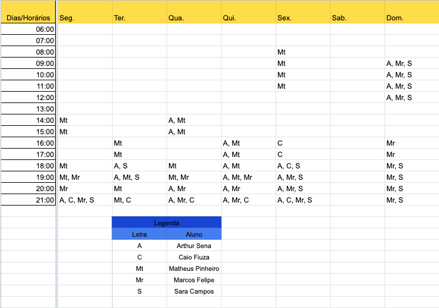

# Planejamento

## 1. Sites Avaliados e Escolha do Grupo

- Arthur Sena - <a href="https://www.notalegal.df.gov.br/" target="blank">Nota Legal DF</a>
- Carlos Fiuza - <a href="http://www.mpu.mp.br/" target="blank">Ministério Público da União</a>
- Marcos Felipe - <a href="https://sae.digital/" target="blank">SAE (Atividade Não Entregue)</a>
- Matheus Pinheiro - <a href="http://www.detran.df.gov.br/" target="blank">Detran DF</a>
- Sara Campos - <a href="https://letterboxd.com/" target="blank">Letterboxd</a>

O grupo discutiu qual seria a melhor opção dentro das avaliadas individualmente
e chegou num consenso de avaliar o site do Detran na disciplina.
A avaliação individual do aluno Matheus Pinheiro pode ser vista 
<a href="https://unbbr-my.sharepoint.com/:b:/g/personal/180030345_aluno_unb_br/Ed6FwKM56TpPqBL4DtmHYIUBlrKRB9T3NPglh-9PV7omkg?e=5cxxm9">aqui</a>.

## 2. Cronograma

### 2.1 Cronograma de Atividades

Cronograma de atividades em grupo da disciplina baseado no plano de ensino, sujeito a alterações.

|Título|Data|Descrição|
|:-----:|:-----------------------------:|:----------------------------------:|
|Apresentação do Projeto Etapa 1|17/08|Planejamento do Projeto e Processo de Design|
|Apresentação do Projeto Etapa 2|31/08|Perfil do Usuário, Personas e Análise de Tarefas|
|Apresentação do Projeto Etapa 3|09/09|Princípios Gerais de Projeto, Metas de usabilidade, Guia de Estilo. (Fase: Análise de Requisitos|
|Apresentação do Projeto Etapa 4|16/09|Planejamento da Avaliação e planejamento do relato dos resultados da avaliação do Storyboard e Análise de tarefas.|
|Apresentação do Projeto Etapa 5|23/09|Relato dos resultados do Story Board, Análise de tarefas e o Planejamento da Avaliação e do relato dos resultados da avaliação do Protótipo de Papel.|
|Apresentação do Projeto Etapa 6|05/10|Relato dos resultados do Protótipo de Papel e Planejamento daAvaliação e do relato dos resultados da avaliação do protótipo de alta fidelidade|
|Apresentação do Projeto Etapa 7|07/10|Verificação dos artefatos construídos no projeto|
|Apresentação do Projeto Etapa Final|20/10|Resultados do Protótipo de Papel e Planejamento da Avaliação e o relato dos resultados da avaliação do protótipo de alta fidelidade.|

<center>
<figcaption>Tabela 1 - Cronograma de atividades</figcaption>
</center>

### 2.2 Disponibilidade dos Integrantes

Tabela criada com o intuito de otimizar a coordenação das atividades em grupo onde 
cada integrante informou em qual horário está livre.

<div style="display: flex; flex-flow: row wrap; justify-content: center; margin: 30px auto"> 
  
</div>
<center>
<figcaption>Figura 1 - Grade de disponibilidade dos integrantes</figcaption>
</center>

## 3. Metodologia 

### 3.1 Extreme Programming (XP)

Para o projeto esta metodologia será usada principalmente por sua categoria ágil e por seus valores condizentes com o contexto do projeto, contexto esse de criação de documentos sem desenvolvimento de software, sendo os valores: <b>Comunicação</b>, <b>Simplicidade</b>, <b>Feedback</b>, <b>Coragem</b> e <b>Respeito</b> [1].

### 3.2 SCRUM

Por possuir muitas entregas e se tratar de um projeto ágil em que o trabalho é dividido iterativamente, o uso de propriedades do SCRUM como Plannings, Sprints e Reviews irá ser adotado pela equipe [2].

### 3.2 Controle de atividades

De forma a manter a rastreabilidade e organização, todas as tarefas a serem feitas estarão disponiveis em forma de <a href="https://github.com/Interacao-Humano-Computador/2021.1-Detran-DF/issues" target="_blank">Issues</a> no repositório do projeto, cada uma será composta pelo autor que ira realizar a atividade, descrição da tarefa e por ventura comentários sobre a sua realizaçao.

### 3.3 Políticas de Branch

Toda branch criada seguirá um padrão para a melhor organização do projeto. Por se tratar de um projeto baseado em documentos, terá apenas um tipo de nomenclatura de branch. Todas as branchs devem ser criadas a partir da <b>master</b> e devem estar nomeadas da seguinte maneira:</p>

``` 
iX_nome_documento 
Exemplo: i04_planejamento_metodologia
```

Sendo i indicando que o número X se trata de uma Issue seguido pelo nome do documento que será desenvolvida na branch. Em ocasiões em que não se está trabalhando com nenhum documento em específico, então deve-se colocar o nome da issue correspondente.

### 3.4 Políticas de Commits

Os commits devem ser feitos de maneira clara e objetiva respeitando os padrões comentados a seguir: </p>

<ul>
    <li> Mensagem na língua inglesa. </li>
    <li> Verbos no present continuos. </li>
    <li> Apresentar o número base da issue. </li>
</ul>

 Exemplo: ` #4 adding planning `

Caso o commit contenha alterações realizadas por mais de uma pessoa deverá ser feito assim:

```
#4 adding planning


Co-authored-by: John Cenna <peacemaker@gmail.com>
```

<b>Observação:</b> O caracter '#' representa, por padrão, um comentário na mensagem de commit. Para evitar problemas basta digitar o comando: `git config --local core.commentChar auto`

## 4. Ferramentas

## 5. Bibliografia

>SIMONE DINIZ JUNQUEIRO BARBOSA, BRUNO SANTANA DA SILVA, <b>Interação Humano-Computador</b>, 1a . Edição, Editora Campus, 2010.

>[1] Higor. <b>Introdução ao Extreme Programming (XP)</b>, 2013. Disponível em: <a href="https://www.devmedia.com.br/introducao-ao-extreme-programming-xp/29249" target="_blank">https://www.devmedia.com.br/introducao-ao-extreme-programming-xp/29249</a>. Acesso em: 12 de agosto de 2021.

>[2] DesenvolvimentoÁgil.com.br, <b> SCRUM </b>, 2014. Disponível em: <a href="http://www.desenvolvimentoagil.com.br/scrum/" target="_blank">http://www.desenvolvimentoagil.com.br/scrum/</a>. Acesso em: 12 de agosto de 2021.

## Versionamento
| Versão | Data | Modificação | Autor |
|--|--|--|--|
| 1.0 | 10/08/2021 | Criação da base do planejamento. | Arthur Sena e Marcos Felipe |
| 1.0.1 | 10/08/2021 | Adição do site escolhido | Arthur Sena |
| 1.0.2 | 12/08/2021 | Adição tópico Metodologia | Carlos Eduardo |
| 1.0.3 | 12/08/2021 | Adição tópico Cronograma | Arthur Sena |