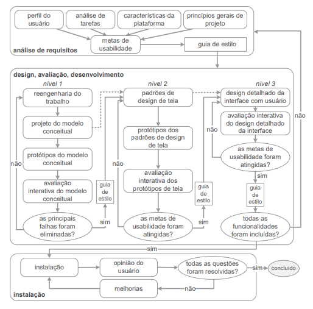

# Usabilidade de Mayhew

## 1. Introdução

 
Para entender o que é a usabilidade Mayhew e como ela é empregada no processo de design, precisamos entender como funciona esse processo, que tem como atividades básicas, a análise da situação atual(identificar o problema), a síntese de uma intervenção e a avaliação dessa intervenção projetada ou já aplicada à situação atual.

 
Sabendo disso, devemos entender a importância de um processo de design, já que o mesmo detalha cada atividade básica a ser feita, por exemplo: como executar cada atividade, a sequência em que elas devem ser executadas, quais atividades podem se repetir, e por quais motivos, e os artefatos consumidos e produzidos em cada uma delas.

## 2. Processo selecionado

 
A escolha foi trabalhar com o processo de Engenharia de Usabilidade de Mayhew, também conhecido como o Ciclo de Vida de Mayhew.

 
A partir de uma análise de processos sugeridos no livro, "Interação Humano-Computador e Experiência do Usuário", de Barbosa et al., concluímos que este seria o melhor processo para utilizarmos.

## 3. Ciclo de Vida de Mayhew

 
O ciclo é dividido em três fases, respectivamente: primeiro a <b>análise de requisitos</b>, em segundo o <b>design, avaliação e desenvolvimento</b> e finalmente a <b>instalação</b>.

    
    <figcaption>Figura 1 - Retirado de: Barbosa et al. "Interação Humano-Computador e Experiência do Usuário". capitulo 6, página 106</figcaption>

 
Como o sistema avaliado é um produto já feito e consolidado, partiremos para o final do ciclo, pois nosso objetivo é analisar e avaliar o produto.
Com isso, começaremos pela etapa de instalação, onde avaliamos o produto com o objetivo de identificar possíveis erros e executar as melhorias necessárias.

 
Após a verificação de erros durante a instalação durante o processo de melhoria, utilizamos o ciclo de vida, voltando a fase inicial, a análise de requisitos, onde são definidas as metas de usabilidade com base no perfil dos usuários, análise de tarefas, possibilidades e limitações da plataforma em que o sistema é executado.

 
Na fase seguinte, design,avaliação e desenvolvimento, a qual tem o objetivo de produzir uma solução que atenda às metas de usabilidade estabelecidas na fase anterior. Aqui, faz-se a reengenharia do trabalho, protótipos conceituais que serão avaliados para definir se tal solução tratou as falhas antes encontradas. Após esse nível, é desenvolvido um protótipo dos padrões de design da tela, sendo avaliado para checar se cumprem com as metas de usabilidade. Passando desse processo, faz-se então o design detalhado da interface do usuário, e enfim uma avaliação geral de todas as funcionalidades. 

 
A solução sendo aceita neste ultimo ponto, pode-se partir novamente para a instalação, onde terá a obtenção das opiniões do usuário final.

## 4. Conclusão

 
Como mostrado acima, o processo de Engenharia de Usabilidade de Mayhew, pelas suas características e diferenças entre outros processos de usabilidade, foi decido que esse processo será colocado em prática, com o objetivo de obter a proposta de solução melhor desenvolvida e coesa com os usuários e entidades relacionadas.

## Referências bibliográficas
> Barbosa, S. D. J.; Silva, B. S. da; Silveira, M. S.; Gasparini, I.; Darin, T.; Barbosa, G. D. J. (2021) Interação Humano-Computador e Experiência do usuário. Autopublicação.

## Versionamento
| Versão | Data | Modificação| Autor |
|--|--|--|--|
| 1.0 | 12/08/2021 | Criação do documento | Matheus |